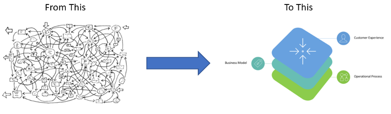
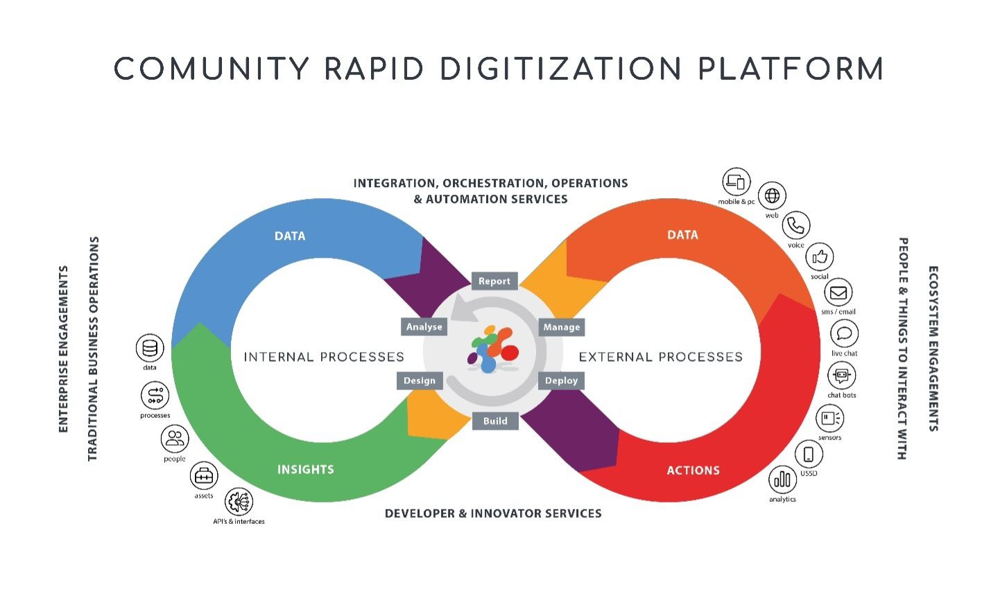
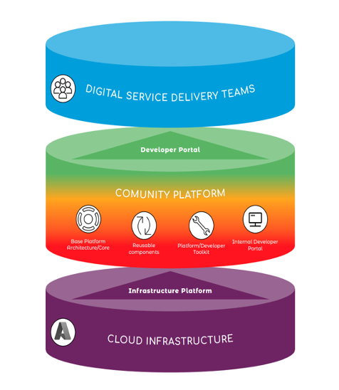
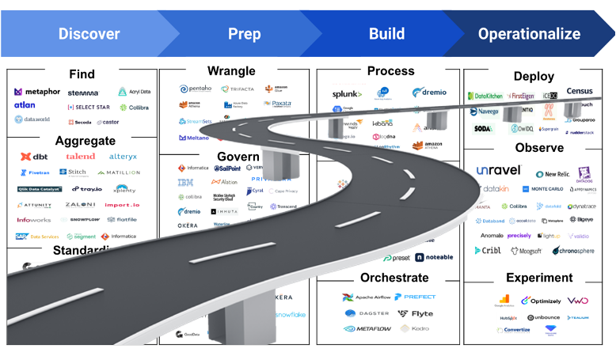

# ComUnity Technical Overview

### ComUnity Digital Service Delivery Platform 

The ComUnity Digital Service Delivery Platform is a comprehensive solution that provides organisations with the tools, templates, and infrastructure they need to build, deploy, and manage digital solutions, products and services. The platform is designed to be highly flexible, scalable, and secure, making it well-suited for organisations of all sizes and industries.

The platform falls into an emerging technology area called Platform Engineering. It aggregates many disparate elements of a digital solution and reduces technical complexity. Platform engineering is a new socio-engineering concept that straddles team structure and the engineering discipline behind it to build scalable and resilient digital platforms. The old way of development teams not communicating with each other and doing whatever they want is now replaced by teams all working on a unified platform.

### Benefits of platform engineering 

Platform engineering allows an autonomous delivery team to use the platform to deliver new product features at a higher pace, with reduced coordination. Other benefits are:

* &#x20;Encourages innovation and creativity
* &#x20;Rapid implementation
* Faster time-to-value
* Governance is baked-in
* Manages all end-to-end business processes
* Reduced cost of development
* &#x20;Improves engagement between IT and business stakeholders
* Standardised user experience
* &#x20;Ease of maintenance\

<figure><figcaption></figcaption></figure>

### ComUnity Core and Processes 

ComUnity has a data-centric intelligent core, connecting external stakeholder experiences with internal systems and processes.

<figure><figcaption></figcaption></figure>

### The ComUnity Platform Engineering Model 

The model adopted by the ComUnity Platform comprises three layers:

<figure><figcaption>
The ComUnity Approach to Platform Engineering
</figcaption></figure>

The Cloud Infrastructure Layer provides organisations with the underlying base cloud infrastructure and services that are necessary to build, deploy, and manage the higher layers of digital products and services.

Many large and complex organisations may choose to assemble “Platform Engineering” teams who build out such an internal platform from scratch. However, the ComUnity Rapid Digitisation Platform contains all the complex platform engineering capabilities out-of-the-box thus removing the need to build out such a platform from scratch. The broad capabilities provided by ComUnity include:

* Base Platform Architecture/Core: the digital foundation required to build an internal Digital Platform.
* Reusable Components: the digital building blocks required to build an internal Digital Platform.
* &#x20;Platform Developer Toolkit: the developer tools and SDKs required to build an internal Digital Platform.
* Internal Developer Portal: the self-service capabilities required to operate an internal Digital Platform.

Digital Service Delivery Teams are the multidisciplinary, compact, co-located, and empowered development teams which build real value adding services and applications on top of the ComUnity Platform Instance. They do this buy leveraging the capabilities of the ComUnity Rapid Digitisation Platform layer.

### ComUnity Provides a Paved Road 

Digital platforms built on the principles of platform engineering offer the concept of a “paved road.” This avoids the complex processes and standards of traditional development, implementation and maintenance. Instead, it provides optimised processes developed using accepted best practices and processes, pre-defined tools, and development languages.

<figure><figcaption></figcaption></figure>
