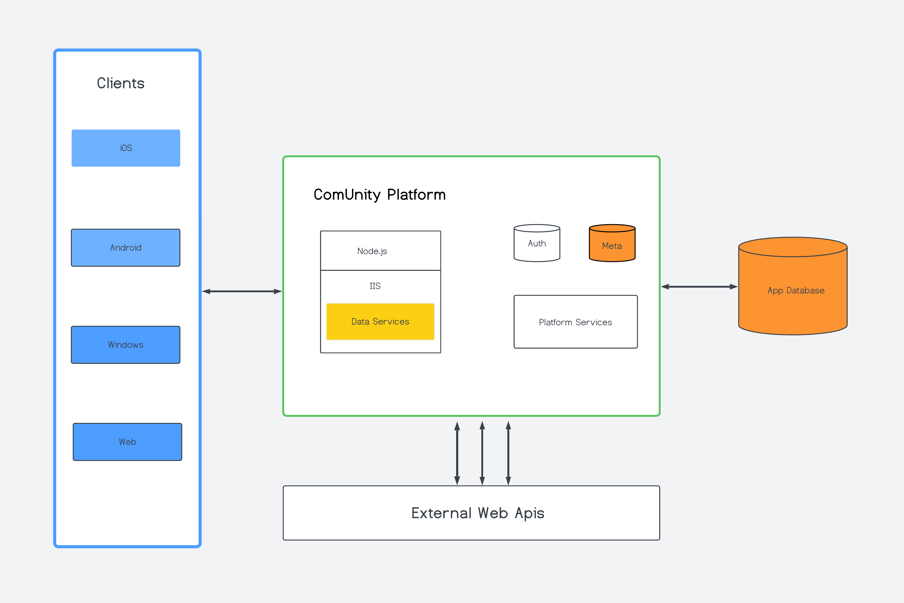

# ComUnity Developer Toolkit

## Overview

The ComUnity Developer Toolkit is a comprehensive platform that simplifies the creation of multi-sided digital platforms for developers. It sets itself apart by offering a single design interface and a powerful Low-Code Rapid Development Interface that not only streamlines the development process but also enables developers to build platforms faster and more cost-effectively compared to traditional manual coding methods. With its unmatched speed, the ComUnity Developer Toolkit empowers developers to bring their digital platforms to life rapidly, giving them a competitive edge over other development tools in the market.

### Key Feature of the ComUnity Developer Toolkit

The ComUnity Developer Toolkit offers a crucial advantage by enabling developers to build their projects efficiently across multiple platforms. This unique capability eliminates the need for separate development efforts for each target platform and significantly reduces redundant tasks.

With the Toolkit, the development phase begins by building the web version of your project. This initial focus provides a visual representation of your project and facilitates testing during development. While working on the web version, you also have the option to set up properties and configurations specific to other client applications within the Toolkit.

To adapt your project for different clients, such as iOS, Windows, and Android, you can utilise the Toolkit's features to define properties and settings unique to each platform. These properties can include platform-specific design elements, device capabilities, or integrations with native features.

By setting up these properties within the Toolkit, you ensure that the generated client applications align with the respective platform requirements. This allows for a seamless and optimised user experience across different devices and operating systems.

Additionally, the Toolkit provides a streamlined workflow for managing the variations between client applications. You can efficiently update and maintain your project by making changes within the Toolkit, which then propagate to all the generated client applications, ensuring consistency and reducing development overhead.

By offering this level of flexibility and customisation, the ComUnity Developer Toolkit empowers developers to efficiently build projects for multiple platforms while maintaining a unified codebase and reducing time and effort spent on redundant development tasks.

The Toolkit supports the end-to-end Digital Project Lifecycle Management, covering the following phases:

* Plan: Within the Toolkit, you can create the high-level requirements for your digital project and design the overall project structure.
* Code: Utilise the Toolkit's development tools, such as the built-in code editor or integration with external tools like Visual Studio, to write the necessary code for your digital project.
* Build: Automated build tools provided by the Toolkit assist in building the required server components and native client applications directly from your code.
* Test: Use the Toolkit's testing capabilities to run tests on the latest builds and ensure the functionality of your digital project.
* Release: Prepare the code and other project assets within the Toolkit for release, making them ready for deployment.
* Deploy: Take advantage of the Toolkit's automated deployment tools, which assist in deploying the builds from development to quality assurance (QA), staging, and production environments.
* Operate: Integrate the Toolkit into server environments to effectively manage the deployment and operation of ComUnity digital projects, ensuring smooth execution and performance.
* Monitor: The Toolkit provides ongoing system health monitoring and allows you to monitor all components of the digital ecosystem, ensuring optimal performance and identifying any potential issues.

By offering an intuitive and streamlined development experience, the ComUnity Developer Toolkit empowers developers to create compelling multi-sided digital platforms efficiently and effectively.

<figure><figcaption></figcaption></figure>

## ComUnity Digital Services Development Life Cycle

The ComUnity Developer Toolkit provides a comprehensive software development life cycle for building digital services. This development life cycle encompasses the following phases:

1. Create a new Project:
   * Begin by creating a new project within the Toolkit, setting the foundation for your digital service development.
2. Define Metadata and Authorization:
   * Define the necessary metadata and authorisation settings for your application within the Toolkit. This includes specifying data structures, user roles, permissions, and authentication mechanisms.
3. Integrate with External Services:
   * Seamlessly integrate your digital service with external services or APIs by leveraging the integration capabilities of the Toolkit. This enables your application to communicate and interact with third-party systems.
4. Build Communication Services:
   * Utilise the Toolkit's features to build communication services within your application. This includes implementing functionalities such as messaging, notifications, real-time updates, and data synchronisation.
5. Build Client Applications:
   * After completing your project within the ComUnity Developer Toolkit, you have the option to enlist the assistance of the ComUnity Team to build client applications for each supported platform.
6. Deploy to Dev/QA/Production Servers:
   * Once the development phase is complete, deploy your application to development, quality assurance (QA), and production servers using the deployment tools provided by the Toolkit. This ensures a controlled and organised release of your digital service.

In addition to the development life cycle, the ComUnity Developer Toolkit offers a range of configurable components. These components can be customised and tailored according to your specific application requirements. The diagram below illustrates the various components that you can configure when utilising the Toolkit:

<figure><figcaption>
ComUnity Platform high level architecture diagram
</figcaption></figure>

By following this comprehensive software development life cycle and leveraging the configurable components of the Toolkit, developers can efficiently create and deploy robust digital services across multiple platforms.\
