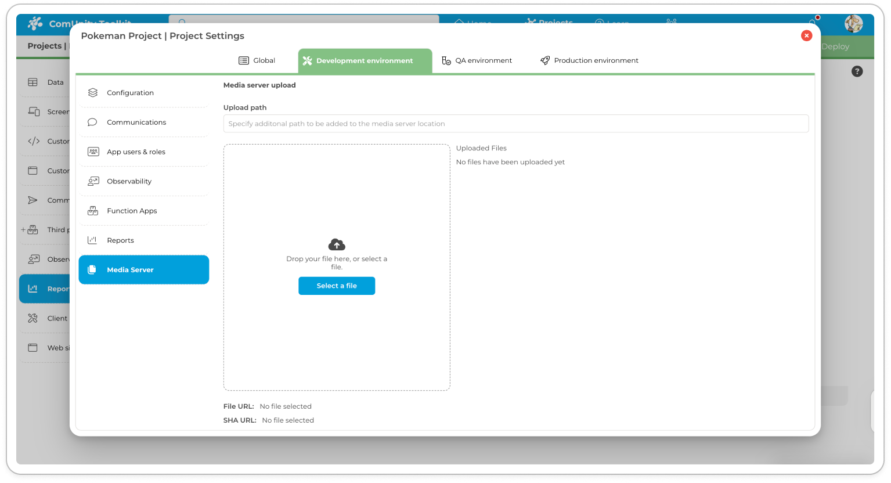

# Templates

## Overview

Templates are preconfigured application components (entities, associations, navigation, screens, and application objects) that can be added to a project to quickly and easily add specific features. **Templates can also be added to a brand new project to fast track creation.**

Templates offer a number of benefits, including:

* **Speed:** Templates  can save you a significant amount of time and effort by providing you with pre-built components that you can simply add to your project.
* **Quality:** Templates  are developed by experienced developers and are tested to ensure that they meet high quality standards.
* **Flexibility:**  Templates can be customised to meet your specific needs.

### **Types of** Templates&#x20;

The platform supports the following types of  templates :

* **Item templates:** These templates add a single feature to a project, such as **Governance**, **Live Chat**, or **Base Temporal Entity**.
* **Group** **templates:** These complex  templates are used to create fully fledged applications with multiple features, such as Blog, Smart City, or Business Directory. A group template is a set of item  templates.

## Adding and removing templates in a ComUnity Project 

&#x20;Templates  may have dependencies, which are references to other  templates. When you add a  templates with dependencies to your project, the Toolkit will automatically add its dependencies to the project. Conversely, when you remove a  template with dependencies, its dependencies are not removed from your project.

### **To add a** template **to a new project**

1. [Create a new project](create-a-project.md) and add the relevant template on initial set up.
2. After successfully creating your project, you can navigate to **Project Settings** > **Templates** to manage templates.

### **To add a** templates **to an existing project**

<figure><figcaption>
Add a template to an existing project
</figcaption></figure>

1. Go to **Project Settings** > **Templates** .
2. All the templates  that are already included in your project will have their checkboxes ticked.
3. Select a  template by ticking its checkbox. Conversely, you may deselect a template by unticking its checkbox.
4. Click **Save**.

**More details about the** **templates that are supported in the ComUnity Development Toolkit:**

Application components (entities, associations, navigation, screens, and application objects) typically have preconfigured permission rules that control user access view [Authorisation](https://app.gitbook.com/o/v0hmafhved1NwFsQQmjL/s/rC7Dtk1BK2ZiDdqV71MV/~/changes/1/general-information/authentication-and-authorisation/authorisation) learn more.

## Supported  Templates&#x20;

The ComUnity Development Toolkit includes a variety of supported templates that can be used to quickly and easily add features to your project. Templates  are preconfigured application components (entities, associations, navigation, screens, and application objects) that are developed by experienced developers and tested to ensure high quality standards.

Using supported  templates can save you a significant amount of time and effort, and can help you to create better quality applications. Templates are also flexible and can be customised to meet your specific needs.

In this subsection, we will list all of the supported  templates that are available in the ComUnity Development Toolkit. We will also provide a brief description of each templates and explain how to use it.

We encourage you to browse the list of supported  templates and to use them to create your own custom applications. If you have any questions or need assistance, please do not hesitate to contact our support team.

#### Application Sharing 

The Application Sharing template adds application components which allow users to share your app though SMS invitation. The [Notifications](https://app.gitbook.com/o/v0hmafhved1NwFsQQmjL/s/rC7Dtk1BK2ZiDdqV71MV/~/changes/1/getting-started/manage-your-project/samples#notifications) templates is a dependency of the ApplicationSharing templates .

#### Base Temporal Entity 

The BaseTemporalEntity in the ComUnity Platform is a no-code template for working with temporal tables. It is recommended that temporal entities inherit from the BaseTemporalEntity.

#### Communities 

The Communities template adds application components which allow admins to manage community data. The [Notifications](https://app.gitbook.com/o/v0hmafhved1NwFsQQmjL/s/rC7Dtk1BK2ZiDdqV71MV/~/changes/1/getting-started/manage-your-project/samples#notifications)  templates  is a dependency of the Communities templates.

#### Economic Development

The Economic Development template provides a comprehensive solution for municipalities to manage economic development efforts in their communities. This template allows businesses to create and manage their listings, while also allowing municipal administrators to send business invitations and other notifications.

The Economic Development template includes dependencies on several other templates, including [Communities](samples.md#communities), [Notifications](samples.md#notifications), and [Push Notifications](samples.md#pushnotifications). These dependencies provide additional functionality and customisation options, such as targeted notifications to specific user groups and real-time updates for users.

With the Economic Development template, municipalities can streamline their economic development efforts and provide a user-friendly platform for businesses to manage their listings and connect with the community. This can help to boost local economic growth and promote a thriving business environment.\
\
**Contact Us**

This  template adds application components which allow admins to add contact us numbers and also allows both users and admins to view contact us numbers.

#### Cases

The Cases template is a logger implementation that allows community members to report cases or issues encountered while using municipal services. Municipal administrators can manage and address submitted logs, view and prioritise them, and track issue resolution progress. [Notifications](samples.md#notifications) is a dependency of the Cases template.\
\
**Feedback**

This  template adds application components which allow users to post feedback and also allows admins to view feedback logs.\
\
**Governance**

The Governance  template includes application components that enable local governments to publish their documents and procedures for public consumption. Although it was initially designed for municipalities, its generic document publishing capabilities can be adapted to fit other use cases.\
\
**LiveChat**

The Live Chat  template provides a generic solution for offering real-time communication with users of digital services, whether it be a website or a mobile application. With the Live Chat feature, users can chat directly with customer service representatives or support agents to get quick answers to their questions, report issues, or provide feedback.\
\
**NewsFeed**\
The NewFeed  template adds application components which allow admins to post and edit news articles and also allows users to view news articles.\
\
**Notifications**

The Notification template enables an application to send both personal and broadcast notifications. Personal notifications can be targeted to a specific user while broadcast notifications are sent to all users of the application. These types of notifications primarily fall under the IN APP channels in the [Communication Services](../../toolkit-guides/communications/) and must be configured programmatically, to learn more view [Trigger the Communication Service](../../toolkit-guides/communications/#trigger-the-communication-service). Additionally, the Community template includes Community Notifications, which can be used to send notifications to a specific community within the application.\
\
**PublicSafety**

The PublicSafety template adds application components which allow admins to manage public safety and also allows users to view vacancies and manage their cvs and job applications. The [Notifications](samples.md#notifications) and [PushNotifications ](samples.md#pushnotifications)templates are dependencies of the PublicSafety template.\
\
**Terms**

The Terms template adds a page in your application that outlines the terms and conditions of using applications built on the ComUnity Platform, this page is accessible to all of your users.\
\
**Twitter**

The Twitter template allows you to add a Twitter feed to your application using a specified hashtag or Twitter handle.  However, currently there is no UI available in the toolkit the configuration of the Twitter feed. You can contact our technical team for assistance in setting up the Twitter feed in your application.\
\
**Vacancies**

The Vacancies template adds application components which allow admins to manage vacancies also allows users to view vacancies and manage their cvs and job applications.\
\
**Youth Development**

The YouthDevelopment  template adds application components which allow admins to post and edit youth opportunities and also allows both admins and users to view youth opportunities.\
\
**Blog**

A Blog template is a pre-built template or functionality that can be used to add a blog section to an application or website. It typically includes features such as the ability to create, edit and publish blog articles and manage comments.\
\
**Business Directory**

The Business Directory template provides functionality to add the business profile to your applications, profile properties which can be added include  photo, address, geo-location and photo.\
\
**Smart City**

The SmartCity template is a complex template which includes the [ApplicationSharing](samples.md#applicationsharing), [BaseTemporalEntity](samples.md#basetemporalentity), [Communities](samples.md#communities), [ContactUs](samples.md#contactus), EconomicDevelopment, [Cases](samples.md#cases) , [Feedback](samples.md#feedback), [Governance](samples.md#governance), [LiveChat](samples.md#livechat), [NewsFeed](samples.md#newsfeed), [Notifications](samples.md#notifications), [PublicSafety](samples.md#publicsafety), [PushNotifications](samples.md#pushnotifications), [Terms](samples.md#terms), [Twitter](samples.md#twitter), [Vacancies](samples.md#vacancies) and [YouthDevelopment](samples.md#youthdevelopment) template. It is used as a template to build smart cities.

#### Surveys

The Survey template provides a flexible way to create and conduct surveys within an application. Users can define custom survey questions using a variety of question types, such as multiple choice, rating scales, and open-ended text fields. These questions can be arranged into a survey form that can be filled out by respondents within the application. Once the survey is complete, the responses can be collected and analysed by the application administrators.
