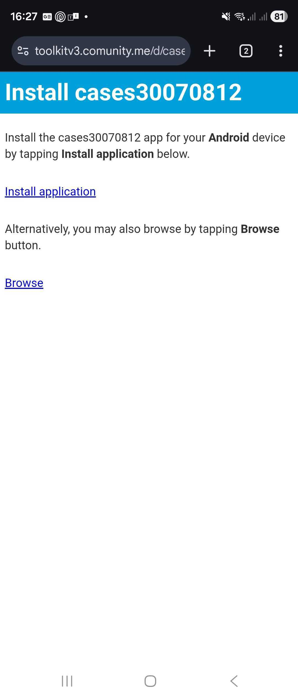
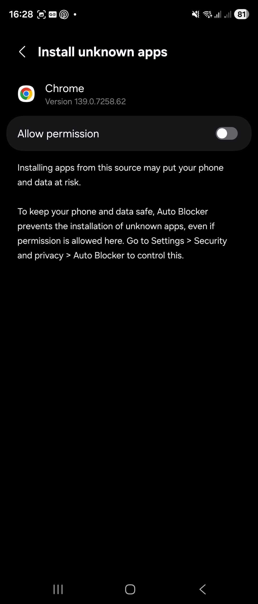

# Client Build

The **Client Build** feature enables you to generate Android and iOS mobile clients directly from the ComUnity Toolkit without installing or configuring a local development environment. From **version 25.2 onwards**, every project without build errors can be packaged into native clients. This capability is included in the core Toolkit offering, no additional licensing or modules are required.

The build process packages your project configuration, assets, and settings into a ready-to-install mobile app, making it ideal for rapid testing, demos, and production deployment.

### Overview

Client Build automates the creation of installable application files for:

* **Android** (`.apk` for direct install or `.aab` for Google Play)
* **iOS** (`.ipa` for TestFlight or local install)

When you start a build, the Toolkit:

1. Pulls your project metadata, configuration, and assets.
2. Injects them into a native client template.
3. Compiles the app via the Toolkit’s **C# build pipeline** on Azure DevOps.
4. Signs and packages the output.
5. Makes the build artefact available for download in the Toolkit UI.

### Day-0 Platform Setup (One-Time per Environment)

Some platform-level configuration must be completed by the ComUnity platform team or environment admin before Client Build is available:

#### Android

* An **APK signing certificate** must be created and uploaded to Azure DevOps Secure Files.\
  How-to: [Android APK Signing Documentation](https://developer.android.com/tools/apksigner)
* Azure DevOps pipeline configuration must be in place for your environment.
* For new environments, contact the ComUnity team for **Azure DevOps build configuration** before attempting the first build.

#### iOS

* An **Apple Developer Program** account must be active.\
  Enrol here: [Apple Developer Enrollment](https://developer.apple.com/programs/enroll/)
* Signing certificates, provisioning profiles, and Team ID must be configured in the organisation’s Apple account.
* These Day-0 steps are handled by the platform team once, and you’ll only need to provide project-level assets thereafter.

### Prerequisites Before You Build

#### Applies to All Builds

* A published project build (ensures metadata exists for the pipeline).
* Project branding and metadata configured (app name, colours, icons, etc.).
* App icon in PNG format, **≥ 512×512**, **32-bit colour**, ≤ 1 MB.
* Confirm there are **no build errors** in the Toolkit.

#### Android-Specific

* **Google Maps API Key**
  * Required only if your app uses maps; otherwise enter `none`.
  * Guide: [Get a Google Maps API Key](https://developers.google.com/maps/documentation/embed/get-api-key)
* **Firebase Configuration (google-services.json)**
  * Create a Firebase project for your app using the **exact package name** generated by the Toolkit.
  * Guide: [Generate google-services.json](https://support.google.com/firebase/answer/7015592)

#### iOS-Specific

* Apple Developer account with correct team permissions.
* App registered in **App Store Connect**.
* Main app icon: **1024×1024 PNG, sRGB colour space**.
* Test devices provisioned or TestFlight testers invited.

### Building a Client

1. **Open Your Project**
   * Navigate to **Project Settings › Client Build** in the Toolkit.
2.  **Enter Build Details**

    **For Android:**

    * Maps API Key (or `none`).
    * Paste the contents of your `google-services.json`.
    * Upload/select your app icon.

    **For iOS:**

    * Upload your icon (Toolkit pulls other details from metadata).
    * Confirm app name and bundle details.
3.  **Start the Build**

    * Click **Build** to queue the job.
    * Azure DevOps will:
      1. Fetch the platform’s native client template.
      2. Insert your project-specific values.
      3. Resize/crop icons as needed.
      4. Compile, sign, and package the app.
      5. Upload the final build artefact to the Toolkit.

    **Build Constraints:**

    * One build per environment at a time.
    * Typical time: **5–6 min** (compile \~3.5 min; signing adds time).
4.  **Download & Install**

    * When complete, a **Download** link appears in the build summary.

    **Android:**

    * Install the APK directly on a device.
    * Enable “Install unknown apps” if prompted and ensure the link uses **HTTPS**.

    **iOS:**

    * Distribute via **TestFlight** or install on provisioned devices via Xcode.

### Deploying to App Stores

**Google Play Store:**

* Download the project archive from the Toolkit.
* Open in **Android Studio** and follow Google’s publishing process:\
  [Publishing on Google Play](https://developer.android.com/studio/publish)

**Apple App Store:**

* Upload via Xcode or Transporter to App Store Connect.
* Complete Apple’s app review and metadata requirements.

### Troubleshooting

| Issue                       | Possible Cause                                                 | Resolution                                 |
| --------------------------- | -------------------------------------------------------------- | ------------------------------------------ |
| Build button disabled       | Missing required fields or invalid file format                 | Check Maps key, Firebase JSON, icon format |
| Nothing happens on build    | Malformed JSON, invalid key, unsupported image format          | Correct inputs and retry                   |
| Build stuck on Compile/Sign | Normal behaviour during long compile; may also be queued       | Wait or retry when queue is free           |
| Android APK won’t install   | Browser blocked install, non-HTTPS link, security scan warning | Enable install unknown apps, use HTTPS     |
| Deploy link fails           | No published project build exists                              | Publish project before building            |

### Best Practices

* Use **unique Maps API and Firebase keys** for each environment to avoid quota issues.
* Test early on **physical devices** to check UI behaviour.
* Optimise icon design for both square and circular cropping.
* Keep signing certificates securely stored in **Azure DevOps Secure Files**.\


### Installing and Running the Android App via the `/d` Handler

After building your Android client, you can install it directly on your device using the **download handler URL**.

#### 1. Access the Download Handler

In your Android browser (e.g., Chrome), visit the `/d` handler for your project:

```
https://toolkitv3.comunity.me/d/{projectname}/
```

**Example:**

* Web Client: `https://toolkitv3.comunity.me/p/myproject/`
* Android Download: `https://toolkitv3.comunity.me/d/myproject/`

> **Note:** If your organisation runs its own Toolkit environment, replace `https://toolkitv3.comunity.me` with your own domain

<figure><figcaption></figcaption></figure>

#### 2. Download the APK

* On the **Install {projectname}** page, tap **Install application**.
* A download prompt will appear. Confirm to download the `.apk` file.
* File size and name will match your project (e.g., `myproject.apk`).

#### 3. Handle "Install Unknown Apps" Security Settings

* If prompted with _“Your phone isn’t allowed to install unknown apps from this source”_, tap **Settings**.
*   On the **Install unknown apps** screen for your browser (e.g., Chrome), enable **Allow permission**.\
    \


    <figure><figcaption></figcaption></figure>
* On Samsung devices, **Auto Blocker** may also prevent installation.
  *   Disable it via:\
      `Settings › Security and privacy › Auto Blocker`.\
      \


      <div align="left" data-full-width="true"><figure><figcaption></figcaption></figure> <figure><figcaption></figcaption></figure></div>

#### 4. Install the App

* Return to the APK prompt and tap **Install**.
*   If your phone runs a security scan, approve the result.\
    \


    <figure><figcaption></figcaption></figure>

#### 5. First Launch

* Open the app after installation.
* Accept the **Terms / Disclaimer** if presented.
*   If your build includes Firebase configuration (`google-services.json`), you’ll see a **Allow Notifications** prompt, choose **Allow** or **Don’t allow**.\
    \


    <figure><figcaption></figcaption></figure>

#### 6. Log In or Register

* Complete your app’s login or registration flow.

### Running the iOS App

Once your iOS client build is complete, you can install and test it on Apple devices using **TestFlight** or direct provisioning.

#### 1. Using TestFlight

* Ensure your Apple Developer account and **App Store Connect** are set up correctly.
* Upload the signed `.ipa` build to **App Store Connect**.
* In App Store Connect, enable **TestFlight** for your app.
* Add internal or external testers:
  * **Internal testers** can access immediately after upload.
  * **External testers** must be approved through Apple’s beta review process.
* Invite testers via email or by sharing the TestFlight public link.
* Testers must install the **TestFlight** app from the **App Store** and accept the invitation.

**Apple Documentation:**\
[TestFlight Overview – Apple Developer](https://developer.apple.com/testflight/)

#### 2. Installing on Provisioned Devices

* If you have provisioning profiles configured in your Apple Developer account:
  * Connect the iOS device to a Mac.
  * Open **Xcode**.
  * Select the device in the **Devices and Simulators** window.
  * Drag and drop the signed `.ipa` file onto the device.

**Apple Documentation:**\
[Distributing Your App to Registered Devices – Apple Developer](https://developer.apple.com/documentation/xcode/distributing-your-app-to-registered-devices)

### Conclusion

The **Client Build** feature streamlines the process of producing ready-to-install Android and iOS applications directly from the ComUnity Toolkit, eliminating the need for complex local development setups. By following the prerequisites, platform setup, and build steps, teams can quickly deploy test-ready mobile clients for demonstrations, QA, and stakeholder reviews.

Whether distributing via the `/d` handler for Android, TestFlight for iOS, or pushing to public app stores, the process ensures a smooth path from configuration to installation. For best results:

* Keep assets optimised.
* Maintain separate API keys per environment.
* Test thoroughly on physical devices early in the project cycle.

By integrating Client Build into your workflow, you reduce turnaround time, improve feedback loops, and accelerate delivery of your mobile solutions to users.
