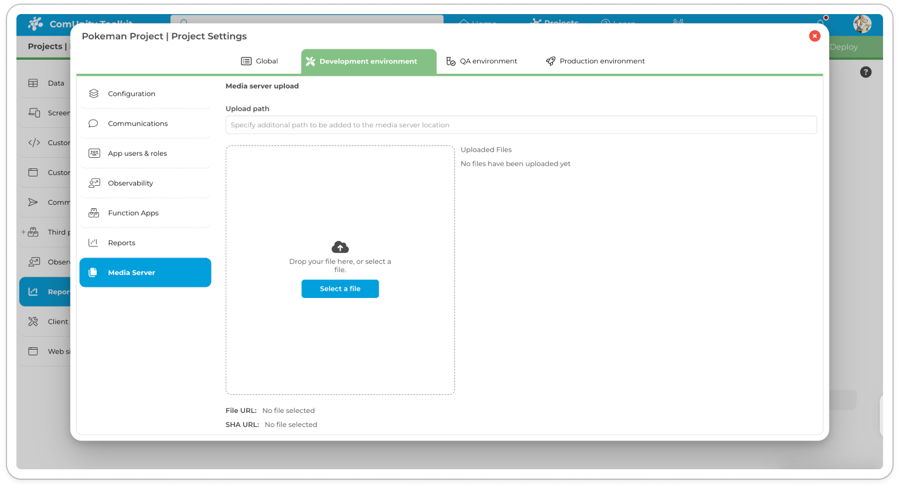

# Media Server

### Introduction

The "media" within the ComUnity Platform's Media Services alludes to the diverse range of content types that the platform can handle, enriching the architecture of digital solutions. The Media Services component of the ComUnity Platform offers a robust layer that efficiently processes requests for every content type it supports. This encompasses two main categories: structured and unstructured data.

### Structured Data Handling

Structured data transactions leverage the OData protocol, presenting a dual interface comprising an API for data manipulation and a URL-based query domain-specific language (DSL) for information retrieval. This approach ensures:

* **Data Parsing:** Interprets OData requests to determine the appropriate data entities, supporting authorisation and adherence to data governance policies.
* **Value-Added Processing:** Prior to data relay to the business logic layer, the system performs essential processing for optimisation.
* **Error Handling:** Enhances the developer experience by appending diagnostic information to errors for quicker resolution.

### Unstructured Data Management

Unstructured data, particularly a wide array of file types, is handled with robust capabilities:

* **Azure Blob Storage Integration:** Seamlessly uploads and downloads large files (up to 270 GB), featuring functionalities such as de-duplication, download resumption, and cache management.
* **HTTP Feature Utilisation:** Employs partial GET requests, enabling browsers to manage video playback efficiently when accessing large video files hosted on the platform.

### Specialised Media Processing

The platform excels in media adaptation and optimisation through:

* **Image Transformation Pipeline:** Utilises a declarative approach for dynamic image processing, which adapts content according to device capabilities to optimise bandwidth and processing requirements.
* **Caching Mechanism:** Improves performance by caching image transformations, minimising CPU usage on subsequent requests.

### Iconography Support

Delivering a comprehensive icon set handling, the server:

* **SVG API Utilisation:** Offers access to standard icon repositories, including Font Awesome, Noun Project, and Material Design, complete with on-the-fly rasterisation connected to the image transformation pipeline for efficient icon generation.

\
By default the ComUnity Developer Toolkit Media Server supports _anonymous_ public read access to storage resources, to increase the security of your applications you may opt to use the [managed media server ](media-server.md#managed-media-server)as it only allows permission based and time-bound access to storage resources.\


<figure><figcaption></figcaption></figure>

<pre><code><strong>// Supported file formats:
</strong>Extension -> MIME type
		.jar 		application/java-archive
		.json 		application/json
		.doc 		application/msword
		.bin 		application/octet-stream
		.pdf 		application/pdf
		.crl 		application/pkix-crl
		.eps 		application/postscript
		.apk 		application/vnd.android.package-archive
		.xls 		application/vnd.ms-excel
		.xlsm 		application/vnd.ms-excel.sheet.macroEnabled.12
		.ppt 		application/vnd.ms-powerpoint
		.pptm 		application/vnd.ms-powerpoint.presentation.macroEnabled.12
		.docm 		application/vnd.ms-word.document.macroEnabled.12
		.xps 		application/vnd.ms-xpsdocument
		.xlsx 		application/vnd.openxmlformats-officedocument.spreadsheetml.sheet
		.docx 		application/vnd.openxmlformats-officedocument.wordprocessingml.document
		.pptx 		application/vnd.openxmlformats-officedocument.presentationml.presentation
		.cod 		application/vnd.rim.cod
		.rm 		application/vnd.rn-realmedia
		.wasm 		application/wasm
		.xhtml 		application/xhtml+xml
		.z 			application/x-compress
		.manifest 	application/x-ms-manifest
		.gz 		application/x-gzip
		.swf 		application/x-shockwave-flash
		.tar 		application/x-tar
		.zip 		application/x-zip-compressed
		.midi 		audio/mid
		.mp3 		audio/mpeg
		.oga 		audio/ogg
		.wav 		audio/wav
		.wma 		audio/x-ms-wma
		.bmp 		image/bmp
		.gif 		image/gif
		.jpg 		image/jpeg
		.png 		image/png
		.svg 		image/svg+xml
		.tiff 		image/tiff
		.ico 		image/x-icon
		.pnm 		image/x-portable-anymap
		.wbmp 		image/vnd.wap.wbmp
		.plist 		application/x-plist
		.mht 		message/rfc822
		.css 		text/css
		.csv 		text/csv
		.html 		text/html
		.js 		text/javascript
		.txt 		text/plain
		.jad 		text/vnd.sun.j2me.app-descriptor
		.xml 		text/xml
		.vcf 		text/x-vcard
		.3gp 		video/3gpp
		.avi 		video/avi
		.mov 		video/quicktime
		.mp4 		video/mp4
		.mpg 		video/mpeg
		.ogg 		video/ogg
		.webm 		video/webm
		.flv 		video/x-flv
		.asf 		video/x-ms-asf
		.wmv 		video/x-ms-wmv
		.movie 		video/x-sgi-movie
		.msg 		application/vnd.ms-outlook

</code></pre>

## Media Server Upload UI

The Media Server Upload interface in the ComUnity Developer Toolkit provides developers with a convenient, environment-specific upload utility for managing media assets such as images, documents, and other supported file types

### Environment-Specific Uploads

Uploads are scoped per environment:

* Development
* QA
* Production

This ensures that media files can be tested independently in each environment without risk to live data or configurations.

### Uploading Files

To upload a media file:

1.  Navigate to Project Settings > Media Server.\


    <figure><figcaption></figcaption></figure>
2. Select the appropriate environment tab (e.g., _Development environment_).
3. Optionally enter an Upload path (subdirectory under /u/).
4. Drag and drop a file or use the Select a file button.
5. The file will be uploaded and listed in the Uploaded Files panel.

Each file uploaded to the media server is stored using the SHA-based naming convention described in the[ Managing File Uploads](media-server.md#managing-file-uploads) section.

### Accessing Uploaded Files

Once uploaded, each media file provides:

* File URL: A permanent public URL for direct access or embedding.
* SHA URL: A deterministic, hashed path derived from the file’s contents and metadata, which prevents duplication and supports version integrity.\


Both URLs are displayed at the bottom of the upload panel upon successful upload. You may click on the file entry to copy either URL for use in your application.

### Deleting Media Files

Each uploaded asset includes a trash can icon.

Clicking the icon allows you to delete the asset from the environment’s media server store.

Note: Deletion is permanent and scoped to the selected environment only.

## Managing file uploads

### SHA File Naming

All files uploaded to the media follow a SHA’s standard file naming convention:


Although use of the SHA File Naming convection prevents duplicate file uploads, its main disadvantage is that uploading an existing file/s are overwritten.


#### Image file types&#x20;

```
SHA_of_file.red.green.blue.alpha.width.height.file_extension 
e.g.
081b278349bb8499788bca8427f11063c73a666a66a8422840311e3397de5ad5.186.188.189.0.300.300.png
```

#### Other file types&#x20;

```
SHA_of_file.file_extension
e.g.
0aa941b04274ae04dc5a9bd214f7d5214f36e6de.txt 
4dac5a4344f76fdcc496af643cfb094de5fcc6743f8e125c1e4c4415d5115a0c.xml 
```


The Filenames Data Service maintains a mapping of the original file name (or friendly name) to the SHA name.


### Upload a single file

```
// Example of uploading an image to the Breede app media server using POSTMAN
POST https://breede.qa.comunity.me/u/web_main_menu.png HTTP/1.1
		Content-Type: application/octet-stream
		User-Agent: PostmanRuntime/7.32.3
		Accept: */*
		Cache-Control: no-cache
		Postman-Token: dc9d1faa-56e6-4c11-b7f6-46a4d532fcc7
		Host: breede.qa.comunity.me
		Accept-Encoding: gzip, deflate, br
		Connection: keep-alive
		Content-Length: 944662
		<binary file content>
		
		HTTP/1.1 201 Created
		Server: Microsoft-HTTPAPI/2.0
		access-control-allow-headers: Authorization,Content-Type,Cache-Control,X-Requested-With,X-XSRF-TOKEN,If-None-Match,X-Original-Id
		access-control-allow-origin: *
		access-control-allow-methods: GET,POST,PUT,DELETE,PATCH,OPTIONS
		Location: /u/d/e04507068cd8da2e65eb3cbd7968265e876f94daaae38086ab08c9ce34293041.202.194.189.0.1852.1135.png
		ETag: "f062bd36e355276449b5e0f88ba9a82bae9b694cf1b208b5e84defff0acf1830"
		Date: Fri, 07 Jul 2023 10:55:03 GMT
		Content-Length: 92
		e04507068cd8da2e65eb3cbd7968265e876f94daaae38086ab08c9ce34293041.202.194.189.0.1852.1135.png
```

## Retrieve files&#x20;

The format of the URL used to retrieve storage resources from a public Media server:

```
<<Base URL>>/u/<<args>>
```

**Notes:**

* `Base URL`: this specifies the base url of your project, during development its  `https://toolkitv3.comunity.me`&#x20;
* `u` : this segment of the URL denotes the **Media Server**, it is required.
* `args` represent various arguments or parameters which are used to define your search.

<table><thead><tr><th width="127.33333333333331">Argument</th><th width="163">Type</th><th>URL Definition</th></tr></thead><tbody><tr><td>d</td><td>Direct</td><td><code>/u/d/&#x3C;&#x3C;SHA File Name>></code></td></tr><tr><td>f</td><td>Friendly</td><td><code>/u/f/&#x3C;&#x3C;Friendly File Name>></code></td></tr><tr><td>icon</td><td>Icon</td><td><code>/u/icon/&#x3C;&#x3C;RRGGBB>>/&#x3C;&#x3C;size>>/&#x3C;&#x3C;opacity>>/&#x3C;&#x3C;icon_image>></code></td></tr><tr><td>g</td><td><a href="http://www.graphicsmagick.org/">Graphics Magick</a></td><td><code>/u/g/&#x3C;&#x3C;SHA File Name>>/&#x3C;&#x3C;modifier>></code></td></tr></tbody></table>

### Image manipulation

When fetching images from the Media Server you can append optional arguments to the URL string which allow you to manipulate your images. These modifiers used to manipulate images are derived from [Graphics Magick](http://www.graphicsmagick.org/).&#x20;

The table below describes the image modifiers supported in the Media Server:

<table><thead><tr><th width="162">Modifier</th><th width="121">Name</th><th width="358">Description</th></tr></thead><tbody><tr><td><code>$autoOrient</code></td><td>Auto orient</td><td>This modifier is used to automatically adjust the orientation of an image based on its embedded EXIF data. When a photo is taken, the camera records its orientation in the image's metadata. However, some image editors or viewers may not properly handle this information, causing the image to appear rotated incorrectly. The <code>$autoOrient</code> modifier automatically reads the orientation data and rotates the image accordingly. This can be especially useful when dealing with images uploaded from mobile devices or cameras with rotating sensors</td></tr><tr><td><p><code>$blur/</code></p><p><code>&#x3C;&#x3C;radius>>/&#x3C;&#x3C;sigma>></code></p></td><td>Blur</td><td><p>This modifier applies a Gaussian blur to the image, which can be used to reduce noise or soften details. The <code>&#x3C;&#x3C;radius>></code> parameter specifies the radius of the blur kernel, and the <code>&#x3C;&#x3C;sigma>></code> parameter controls the standard deviation of the Gaussian distribution. A larger <code>&#x3C;&#x3C;radius>></code> value will result in a more blurry image, while a larger <code>&#x3C;&#x3C;sigma>></code> value will result in a smoother transition between pixels. The <code>$blur</code> modifier can be used in combination with other modifiers to achieve various effects, such as creating a shallow depth of field or simulating motion blur.</p><p></p><p><br></p></td></tr><tr><td><code>$border/&#x3C;&#x3C;width>>/&#x3C;&#x3C;height>>/&#x3C;&#x3C;colour>></code></td><td>Border</td><td>This modifier adds a border of a specified width and height around the image, with a specified color. The <code>&#x3C;&#x3C;width>></code> and <code>&#x3C;&#x3C;height>></code> parameters specify the size of the border, and the <code>&#x3C;&#x3C;colour>></code> parameter specifies the colour of the border. The <code>&#x3C;&#x3C;colour>></code> parameter can be specified using a variety of formats, including hexadecimal values (e.g. #FF0000), RGB values (e.g. rgb(255,0,0)), or color names (e.g. red). The <code>$border</code> modifier can be used to add visual separation between an image and its surroundings or to create a frame around an image.</td></tr><tr><td><p><code>$charcoal/&#x3C;&#x3C;</code></p><p><code>factor>></code></p></td><td>Charcoal</td><td>The <code>$charcoal/&#x3C;&#x3C;factor>></code> modifier applies a charcoal-like effect to the image, simulating the appearance of a charcoal sketch. The <code>&#x3C;&#x3C;factor>></code> parameter controls the intensity of the effect, with higher values producing more pronounced results. This effect works by simulating the appearance of charcoal on paper, emphasising the edges and contours of the image while reducing the amount of detail and texture. This can be useful for creating artistic or stylized versions of photographs or illustrations. The <code>$charcoal</code> modifier can be combined with other modifiers, such as resizing or cropping, to achieve various effects.</td></tr><tr><td><p><code>$colorize/&#x3C;&#x3C;red>>/</code></p><p><code>&#x3C;&#x3C;green>>/&#x3C;&#x3C;blue>></code></p></td><td>Colorize</td><td>This modifier applies a colour tint to the image, changing the colour balance of the image by blending the original colours with the specified tint. The <code>&#x3C;&#x3C;red>></code>, <code>&#x3C;&#x3C;green>></code>, and <code>&#x3C;&#x3C;blue>></code> parameters specify the intensity of the red, green, and blue colour channels respectively, ranging from 0 to 255. Setting all three values to 0 will result in a grayscale image, while setting them all to 255 will result in a fully saturated tint. The <code>$colorize</code> modifier can be used to add a coloured effect to an image, such as a sepia tone or a blueish tint. This modifier can also be used in combination with other modifiers, such as resizing or cropping, to achieve various effects.</td></tr><tr><td><code>$contrast/&#x3C;&#x3C;+-multiplier>></code></td><td>Contrast</td><td>This modifier modifier adjusts the contrast of the image by multiplying the pixel values by a specified factor. The <code>&#x3C;&#x3C;+-multiplier>></code> parameter can be a positive or negative floating point value, with values greater than 1 increasing the contrast and values between 0 and 1 decreasing the contrast. Negative values will invert the image, effectively swapping the light and dark areas. This modifier can be used to adjust the overall brightness and contrast of an image, bringing out details or emphasizing certain areas. It can also be used in combination with other modifiers, such as resizing or cropping, to achieve various effects.</td></tr><tr><td><code>$crop/&#x3C;&#x3C;x>>/&#x3C;&#x3C;y>></code></td><td>Crop</td><td>The <code>$crop/&#x3C;&#x3C;x>>/&#x3C;&#x3C;y>></code> modifier crops the image to a specified size by removing portions of the image outside the specified region. The <code>&#x3C;&#x3C;x>></code> and <code>&#x3C;&#x3C;y>></code> parameters specify the dimensions of the cropped image in pixels, with <code>&#x3C;&#x3C;x>></code> representing the width and <code>&#x3C;&#x3C;y>></code> representing the height. The <code>$crop</code> modifier can be used to remove unwanted portions of an image or to create a thumbnail of a larger image. When used in combination with other modifiers, such as resizing or rotation, the <code>$crop</code> modifier can be used to achieve various effects. It is also possible to specify the position of the crop area using additional parameters, such as <code>$crop/&#x3C;&#x3C;x>>/&#x3C;&#x3C;y>>/&#x3C;&#x3C;width>>/&#x3C;&#x3C;height>></code>, where <code>&#x3C;&#x3C;width>></code> and <code>&#x3C;&#x3C;height>></code> represent the dimensions of the crop area and <code>&#x3C;&#x3C;x>></code> and <code>&#x3C;&#x3C;y>></code> represent the position of the top-left corner of the crop area.</td></tr><tr><td><code>$drawText/&#x3C;&#x3C;x>>/&#x3C;&#x3C;y>>/&#x3C;&#x3C;text>>/&#x3C;&#x3C;colour>>/&#x3C;&#x3C;fontSize>></code></td><td>Draw Text</td><td><p>This modifier adds text to the image at a specified position. The <code>&#x3C;&#x3C;x>></code> and <code>&#x3C;&#x3C;y>></code> parameters specify the coordinates of the top-left corner of the text box in pixels. The <code>&#x3C;&#x3C;text>></code> parameter specifies the text to be added to the image. The <code>&#x3C;&#x3C;colour>></code> parameter specifies the color of the text, which can be specified using a variety of formats, including hexadecimal values, RGB values, or color names. The <code>&#x3C;&#x3C;fontSize>></code> parameter specifies the size of the text in points.</p><p>The <code>$drawText</code> modifier can be used to add titles, captions, watermarks, or other textual elements to images. The position of the text can be adjusted using different values for <code>&#x3C;&#x3C;x>></code> and <code>&#x3C;&#x3C;y>></code>, and the appearance of the text can be customized by changing the values of the <code>&#x3C;&#x3C;colour>></code> and <code>&#x3C;&#x3C;fontSize>></code> parameters. The <code>$drawText</code> modifier also supports additional parameters for adjusting the font, style, and alignment of the text.</p></td></tr><tr><td><code>$enhance</code></td><td>Enhance</td><td><p>The <code>$enhance</code> modifier applies an image enhancement algorithm to the image, improving the overall clarity and detail of the image. This modifier works by analyzing the image and adjusting the brightness, contrast, and sharpness of the image to bring out more detail and reduce noise. The <code>$enhance</code> modifier can be used to improve the quality of photographs or other images that may be slightly blurry or lacking in detail. It can also be used in combination with other modifiers, such as resizing or cropping, to achieve various effects.</p><p><br></p></td></tr><tr><td><code>$equalize</code></td><td>Equalize</td><td><p>The <code>$equalize</code> modifier applies histogram equalization to the image, adjusting the distribution of pixel values to improve the contrast and visibility of details in the image. This modifier works by mapping the pixel values of the image to a new set of values that are more evenly distributed across the available range. The result is an image with improved contrast and brightness, with details that may have been difficult to discern in the original image now more visible.</p><p>The <code>$equalize</code> modifier can be used to improve the visibility and clarity of images that may have been poorly exposed or have uneven lighting. It can also be used in combination with other modifiers, such as resizing or cropping, to achieve various effects. However, it should be noted that the application of this modifier can sometimes lead to an exaggerated or unnatural appearance in some images, and may not always be suitable for every use case.</p></td></tr><tr><td><code>$flatten</code></td><td>Flatten</td><td><p>The <code>$flatten</code> modifier merges all layers of the image into a single layer, resulting in a flattened image. This modifier is useful when working with images that have multiple layers, such as those that have been created in image editing software, or when combining multiple images into a single image.</p><p>When multiple layers are present in an image, each layer can contain different visual elements, such as text, graphics, or effects. The <code>$flatten</code> modifier removes these layers and combines all the visual elements into a single layer, resulting in a simplified image that can be used for various purposes.</p><p>It should be noted that applying the <code>$flatten</code> modifier is a destructive operation, as it permanently removes the separate layers from the image. It is therefore important to create a backup copy of the original image before using this modifier.</p></td></tr><tr><td><code>$flip</code></td><td>Flip Vertically</td><td><p>The <code>$flip</code> modifier flips the image horizontally along the vertical axis, effectively creating a mirror image of the original image. This modifier is useful when working with images that need to be reversed or mirrored, such as when creating reflections or simulating a flipped object.</p><p>When applied, the <code>$flip</code> modifier changes the orientation of the image, effectively flipping it from left to right. This can be used to create a symmetrical effect or to correct the orientation of an image that may have been scanned or captured in an inverted or mirrored state.</p><p>It is important to note that the <code>$flip</code> modifier is a non-destructive operation, meaning that the original image is not modified in any way. Instead, a new image is created with the flipped orientation.</p></td></tr><tr><td><code>$flop</code></td><td>Flip Horizontally</td><td><p>The <code>$flop</code> modifier flips the image vertically along the horizontal axis, effectively creating an upside-down version of the original image. This modifier is useful when working with images that need to be reversed or mirrored, such as when creating reflections or simulating a flipped object.</p><p>When applied, the <code>$flop</code> modifier changes the orientation of the image, effectively flipping it from top to bottom. This can be used to create a symmetrical effect or to correct the orientation of an image that may have been scanned or captured in an inverted or mirrored state.</p><p>It is important to note that the <code>$flop</code> modifier is a non-destructive operation, meaning that the original image is not modified in any way. Instead, a new image is created with the flipped orientation.</p></td></tr><tr><td><code>$normalize</code></td><td>Normalise</td><td><p>The <code>$normalize</code> modifier applies a normalization algorithm to the image, adjusting the contrast and brightness of the image so that the full range of pixel values is utilized. This modifier is useful for images that have uneven lighting or contrast, or images that have been poorly exposed.</p><p>When applied, the <code>$normalize</code> modifier analyzes the distribution of pixel values in the image and adjusts them so that the darkest pixels are set to black, and the brightest pixels are set to white, with all other pixel values adjusted proportionally in between. This results in an image with improved contrast and brightness, with details that may have been difficult to discern in the original image now more visible.</p><p>The <code>$normalize</code> modifier can be used to improve the visibility and clarity of images that may have been poorly exposed or have uneven lighting. It can also be used in combination with other modifiers, such as resizing or cropping, to achieve various effects.</p></td></tr><tr><td><code>$oil/&#x3C;&#x3C;radius>></code></td><td>Oil painting</td><td><p>The <code>$oil</code> modifier applies an oil painting effect to the image, simulating the appearance of an oil painting by applying a brushstroke-like texture to the image. This modifier is useful for adding a creative effect to photographs or other images.</p><p>When applied, the <code>$oil</code> modifier analyzes the image and applies a filter that simulates the appearance of brushstrokes. The level of detail in the brushstrokes is controlled by the <code>radius</code> parameter, with larger values resulting in a more pronounced effect.</p><p>It is important to note that the <code>$oil</code> modifier is a non-destructive operation, meaning that the original image is not modified in any way. Instead, a new image is created with the oil painting effect applied. Additionally, it should be noted that the <code>$oil</code> modifier may not be suitable for all types of images, and may produce better results on certain types of images, such as landscapes or portraits.</p></td></tr><tr><td><p><code>$resize/&#x3C;&#x3C;width>>/&#x3C;&#x3C;height>>/</code></p><p><code>&#x3C;&#x3C;options>></code></p></td><td>Resize</td><td><p>m – maintain aspect ratio but width and height are minimum </p><p>! – exact size p – size in percentage a – maximum area in pixels of an image g – change dimensions only if width or height exceeds s – resizes only if both dimension are less</p></td></tr><tr><td><code>$rotate/&#x3C;&#x3C;colour>>/&#x3C;&#x3C;degrees>></code></td><td>Rotate</td><td><p>The <code>$rotate</code> modifier rotates the image by a specified number of degrees, with an optional background color for the empty space created by the rotation. This modifier is useful for adjusting the orientation of images that may have been taken at an angle, or for creating special effects with rotated images.</p><p>When applied, the <code>$rotate</code> modifier rotates the image by the specified number of degrees, either clockwise or counterclockwise. The background color parameter specifies the color to use for the empty space created by the rotation, if any. If no background color is specified, the empty space is filled with transparency.</p><p>The <code>$rotate</code> modifier can be used to adjust the orientation of images that may have been taken at an angle, or to create special effects with rotated images. For example, rotating an image by 45 degrees and applying other modifiers, such as resizing or cropping, can create a unique and interesting visual effect.</p><p>It is important to note that rotating an image can result in loss of quality or detail, particularly if the rotation angle is large. It is therefore recommended to use the <code>$rotate</code> modifier judiciously and to carefully consider the desired output before applying it.</p></td></tr><tr><td><code>$sepia</code></td><td>Sepia</td><td><p>The <code>$sepia</code> modifier applies a sepia tone effect to the image, giving it an aged, vintage look. This modifier is useful for adding a nostalgic or artistic effect to photographs or other images.</p><p>When applied, the <code>$sepia</code> modifier converts the image to a sepia tone by reducing the saturation of the image and applying a brownish-yellow color cast. The amount of sepia tone applied can be adjusted by changing the intensity of the effect.</p></td></tr><tr><td><code>$thumb/&#x3C;&#x3C;size>></code></td><td>Thumbnail</td><td>The <code>$thumb</code> modifier creates a thumbnail image of the original image with a specified maximum size. This modifier is useful for creating smaller versions of images for use on websites or in documents.</td></tr><tr><td><code>$type/&#x3C;&#x3C;type>></code></td><td>Type</td><td>&#x3C;&#x3C;type>> - Bilevel Grayscale (default) Palette PaletteMatte TrueColor TrueColorMatte ColorSeparation ColorSeparationMatte Optimize</td></tr></tbody></table>

| Option  | Details                                                                                                                                                                                                                                   |
| ------- | ----------------------------------------------------------------------------------------------------------------------------------------------------------------------------------------------------------------------------------------- |
| colour  | Named colour, e.g. red 0xRGB, hex numbers 0xRRGGBB, 8 bits each 0xRRGGBBAA, 8 bits each                                                                                                                                                   |
| gravity | NorthWest, North, NorthEast, West, Center, East, SouthWest, South, or SouthEast                                                                                                                                                           |
| options | m – maintain aspect ratio but width and height are minimum ! – exact size p – size in percentage a – maximum area in pixels of an image g – change dimensions only if width or height exceeds s – resizes only if both dimension are less |
| type    | Bilevel Grayscale (default) Palette PaletteMatte TrueColor TrueColorMatte ColorSeparation ColorSeparationMatte Optimize                                                                                                                   |
