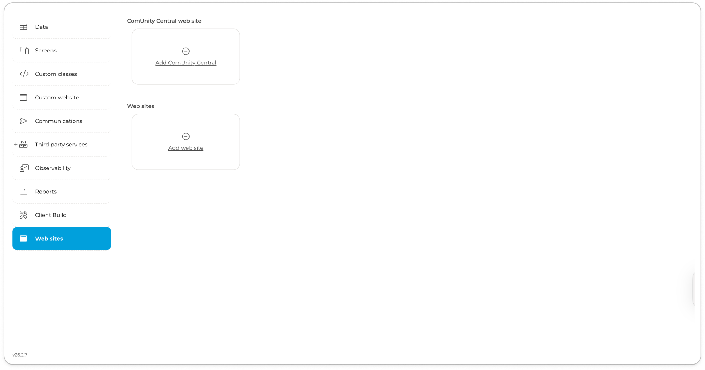

# Web sites & ComUnity Central


The features described in this guide, including both[ Standard Web sites ](web-sites-and-comunity-central.md#standard-web-sites)and [Community Central](web-sites-and-comunity-central.md#community-central), are available in Toolkit v25.2 and later.


The ComUnity Developer Toolkit provides a powerful low-code environment for rapidly building the core of your digital service. But what happens when your project has a unique requirement that goes beyond the standard components?

This is where the **Web sites** and **ComUnity Central** features provides the essential leeway. It is the Toolkit's dedicated extensibility layer, serving as a powerful "escape hatch" that allows you to build any custom front-end experience you can imagine.

Whether you need to create a simple admin panel, a specific back-office tool, or a complete customer-facing portal, this feature allows you to build and embed a self-contained "site within a site." It gives you the ultimate flexibility to extend our core offering and meet any use-case-specific need.\


To address these needs, the Toolkit provides two distinct features for creating custom front-ends:

* [**Standard Web sites**](web-sites-and-comunity-central.md#standard-web-sites): For deploying self-contained static sites using HTML, CSS, and JavaScript. This feature is best suited for content-driven pages or simple tools that do not require a client-side build process.
* [**Community Central**](web-sites-and-comunity-central.md#community-central): For deploying a complete React application. This feature is the designated solution for building complex, interactive Single Page Applications (SPAs) that can handle sophisticated UI, state management, and client-side calls to any third-party API.


<figure><figcaption><p>Web sites in the ComUnity Developer Toolkit</p></figcaption></figure>

## Standard Web sites

The Web Sites feature allows you to deploy and manage static web content directly from your Toolkit project. It is the perfect choice for simple landing pages, documentation, or basic front-end interfaces that don't require a complex build process.

**Common Use Cases**

* Project Landing Page: A simple marketing or informational microsite to introduce your solution.
* API Documentation: Host static HTML documentation for your project's APIs.
* Simple Admin Tools: Create basic forms and dashboards for internal project administration.
* Terms of Service Pages: Host standalone legal documents like privacy policies or terms of use.
* "Lite" User Portals: A lightweight interface for users to view information without the complexity of a full application.

**Key Capabilities**

* Host Static Content: Deploy websites built with HTML, CSS, JavaScript, images, and fonts.
* Integrated URL Routing: Websites are served through the platform's built-in `/w/` URL handler for seamless access.
* Direct File Management: Upload and manage your site's files and folders directly within the Toolkit.

**Understanding the URL Structure**

Every website you create is assigned a unique URL based on the following pattern:

`https://<domain>/w/<project-name>/<url-suffix>`

| Component          | Description                                    | Example                         |
| ------------------ | ---------------------------------------------- | ------------------------------- |
| `https://<domain>` | The base domain of your Toolkit environment.   | `https://toolkitv3.comunity.me` |
| `/w/`              | The platform's internal Static Web Handler.    | `/w/`                           |
| `<project-name>`   | The unique identifier of your Toolkit project. | `pokemon`                       |
| `<url-suffix>`     | A custom path you define during creation.      | `games`                         |

Example URL: `https://toolkitv3.comunity.me/w/pokemon/games/index.html`

### **Creating a Web site**

1. Open your project and navigate to the Web sites section.
2. Scroll past the "Community Central" tile to the Web sites area.
3. Click **+Add** web site to open the creation dialog.
4. In the dialog, enter a URL suffix (e.g., `my-app`, `tools`, `admin`).
5. Click Create. Your website is now ready for you to upload content.

### **Managing Your Web site**

Once a website is created, you can click  **Edit** on its tile to access the file manager. From here you can:

* Add file: Upload individual files like `index.html`, stylesheets, or scripts.
* Add folder: Create new directories to organise your content.
* Upload archive: Import a `.zip` file containing your entire site structure. This is the most efficient way to deploy a complete site.
* Download site archive: Export the current site files as a `.zip` archive.


The default entry point for any website must be an index.html file placed at the root level of your uploaded files. If this file is missing or in a sub-folder, the site will not load correctly.


## Community Central

Community Central is a specialised web site project type within the ComUnity Developer Toolkit, designed to act as the central portal for a solution. Unlike regular static web sites, this option generates a React-based app with project scaffolding and local development capabilities.

**Why Use Community Central?**

While standard web sites are excellent for simple content, modern user portals demand complex UIs and streamlined development workflows. Community Central was built to meet these needs by providing:

* **Go Beyond Toolkit APIs**: Overcome backend limitations. Because Community Central is a complete React application, it can call _any_ remote API, not just those provided by the Toolkit. This allows you to integrate third-party services (e.g., Stripe for payments, Google Maps for location data, or any other REST API) directly into your user-facing portal, giving you limitless integration possibilities.
* **Accelerated Setup**: Get a complete, build-ready React application with a single click, saving you from complex manual configuration.
* A "Golden Path" for Development: Start with a project scaffold that follows industry best practices, ensuring a solid, maintainable foundation.
* Streamlined Workflow: Easily download the project to work in a rich IDE like VS Code, then deploy your production build back to the Toolkit with a simple archive upload.
* **Focus on Your Application, Not on Tooling:** Spend your time building features, not wrestling with configuration.

**Common Use Cases**

* Customer Self-Service Portal: A full-featured portal for users to log in, manage their accounts, and view data.
* Interactive Data Dashboard: A dynamic Single Page Application (SPA) that presents data from your project's APIs with interactive charts and tables.
* Partner or Vendor Platform: A central hub for third-party partners to onboard and interact with your solution.


You can only create one Community Central site per project. If your solution requires multiple web portals, use the standard Web Site feature for any additional sites.


**Key Features**

| Feature                    | Description                                                                     |
| -------------------------- | ------------------------------------------------------------------------------- |
| Powered by React           | Automatically generates a complete React project and handles the initial build. |
| Integrated File Management | View, edit, and organise project files directly from the Toolkit's UI.          |
| Full Source Code Access    | Download the entire React project to work in your preferred local environment.  |
| Instant Live Preview       | Instantly accessible via the platform's `/w/` URL handler.                      |

### **Creating Your Community Central Site**

1. From your project's dashboard, navigate to the Web sites section.
2. Locate the Community Central web site tile at the top.
3. Click **Add Community Central** to begin the setup process.
4. Please be patient. The Toolkit is now generating the React project and running the initial build. This may take a few moments.
5. Once complete, the tile will update. You can now:
   * Click Open web site to preview your new portal.
   * Click Edit to start managing your project files.

### **Managing Your  ComUnity Central Web site**

You have two primary ways to manage and customise your ComUnity Central site: directly within the Toolkit for quick edits, or by downloading the project for advanced development.

#### **Quick Edits of the ComUnity Central Web site in the Toolkit**

For simple changes, click Edit on the Community Central tile. From the file manager, you can perform basic operations like Add file, Add folder, Upload archive, and Download site archive.

#### **Advanced Customisation of the ComUnity Central Web Site (Local Development)**

For major changes, work with the project on your local machine:

1. In the file manager view, click Download project archive.
2. Unzip the file and open the project folder in your preferred code editor (e.g., VS Code).
3.  Follow the instructions in the `README.md` file to install dependencies and run the local development server (e.g., `npm install`, then `npm run dev`).\


    
    ```
    ├── index.html
    ├── lib
    |  └── comunity_central-0.0.1.tgz
    ├── package-lock.json
    ├── package.json
    ├── public
    |  └── favicon.ico
    ├── readme.md
    ├── src
    |  ├── components
    |  ├── config
    |  ├── index.jsx
    |  └── reducers
    ├── structure.txt
    └── vite.config.js

    ```
    


4. Make your code changes and test them locally.
5. When ready, run the build command (e.g., `npm run build`) to generate a `build` or `dist` folder.
6. Return to the Toolkit's file manager and use Upload archive to upload a `.zip` of the contents of your build folder. This deploys your changes.

**Understanding the File Structure**

When you open the file manager, you will see the compiled output of the React application. The key files are:

* `index.html`: The main entry point for your application. This file must remain at the root level.
* `favicon.ico`: The site icon. You can replace this with your own.
* `static/`: A folder containing the compiled and minified JavaScript, CSS, and other assets.
* `site_created`: An internal marker file used by the Toolkit. You can safely ignore this file.
